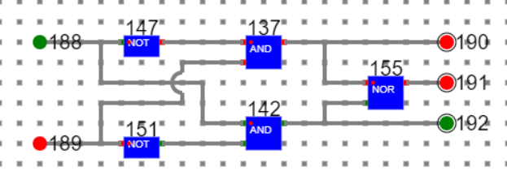
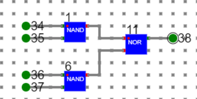
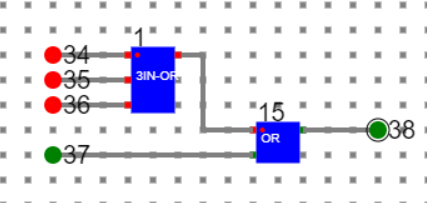
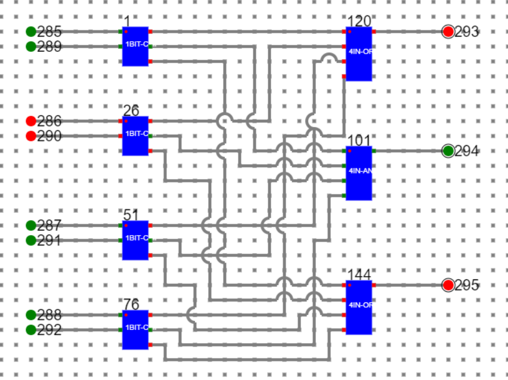

# Procedure

- To draw any diagram in the simulator please follow the manual given in manual section.

- **Step 1.** Design a one bit comparator.
- A one-bit comparator has been designed in the simulator using basic **AND**, **NOT**, and **NOR** gates as shown below.
 

where

**188, 189: Input Bits**

**190** high means **A < B**, 

**191** high means **A = B**, 

**192** high means **A > B**

- Save this as a component say 1BIT-CMP.

- **Step 2.** Design 4 bit comparator
    - A>	Design a 4 input ‘AND’ gate like below.

    

    
    
    

    - B>	Save it as a component say 4IN-AND

    - C>	Design a 4 input ‘OR’ gate like below. This has used one 3 input ‘OR’ gate designed before and a basic ‘OR’ gate readily available in the simulator.
    
    

    
    

    
    - D>	Save it as a component say 4IN-OR.

    - E>	Now design a 4 bit comparator with the help of four 1 bit comparator, one 4 input ‘AND’ gate and two 4 input ‘OR’ as shown below.
    

    
    

             
**1, 26, 51, 76: 1BIT-Comparator**

**120, 144: 4 Input-OR**

**101: 4 input-AND**

**Number1: 285 (LSB), 286, 287, 288 (MSB)**

**Number2: 289 (LSB), 290, 291, 292 (MSB)**

**293 is high: Number1 < Number2**

**294 is high: Number1 = Number2**

**295 is high: Number1 > Number2**

# Manual
- Follow the below manual and perform the experiment
    - Manual --> [Click Here](./simulation/coavlNew.pdf)

<embed src="./simulation/coavlNew.pdf" type="application/pdf">

