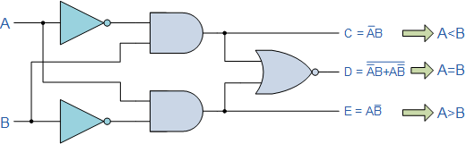
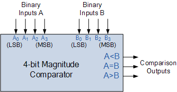

# Theory:

A digital comparator is a combinational circuit that takes two binary numbers as input and determines if one is greater than, less than, or equal to the other. It uses logic gates to perform the comparison and provides outputs for each condition (A > B, A = B, A < B). 

## Comparison logic for a 1-bit magnitude comparator 

- This basic type has two inputs, A and B, and three outputs: A > B, A = B, A < B
- A > B: This is true only when A is 1 and B is 0. 
- A = B: This is true when both A and B are 0, or when both A and B are 1. This condition is the same as the logic for the XNOR (equivalence) gate. 
- A < B: This is true only when A is 0 and B is 1. 

## Multi-bit comparison logic 
- For multi-bit numbers (e.g., A and B, each with 𝑛 bits An−1...A0 and Bn−1...B0), the comparison starts with the most significant bits (𝐴n−1 and 𝐵n−1). 
- If the most significant bits are unequal (e.g., 𝐴n−1=1 and 𝐵n−1=0), the comparison ends there, and the output is determined to be 𝐴 > 𝐵. 
- If the most significant bits are equal, the logic moves to the next bit (𝐴n−2 and 𝐵n−2) and repeats the comparison process. 
- This continues until an inequality is found or all bits have been compared and found to be equal. 
- This cascading principle is how multi-bit comparators are built, often using a 4-bit comparator as a building block for larger systems.

The binary or digital comparator can be constructed using standard AND, NOR and NOT gates to compare the digital signals present at their input terminals and produce an output depending upon the condition of those inputs.

### Two types of Comparator:

1. Identity Comparator – an Identity Comparator is a digital comparator with only one output terminal for when A = B, either A = B = 1 (HIGH) or A = B = 0 (LOW)

2. Magnitude Comparator – a Magnitude Comparator is a digital comparator which has three output terminals, one each for equality, A = B  greater than, A > B  and less than A < B

#### Fig1: 1-bit Digital Comparator Circuit

Then the operation of a 1-bit digital comparator is given in the following Truth Table.

#### Digital Comparator Truth Table

||  Inputs || Outputs||
|:---:|:---:|:---:|:--:|:-:|
| B | A | A > B | A = B | A < B |
| 0 | 0 | 0 | 1 | 0 |
| 0 | 1 | 1 | 0 | 0 |
| 1 | 0 | 0 | 0 | 1 |
| 1 | 1 | 0 | 1 | 0 |

As well as comparing individual bits, we can design larger bit comparators by cascading together n of these and produce a n-bit comparator just as we did for the n-bit adder in the previous tutorial. Multi-bit comparators can be constructed to compare whole binary or BCD words to produce an output if one word is larger, equal to or less than the other.

#### Fig2: 4-bit Magnitude Comparator

