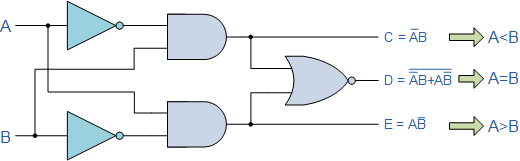
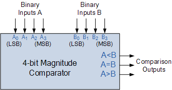

# Theory:
The binary or digital comparator can be constructed using standard AND, NOR and NOT gates to compare the digital signals present at their input terminals and produce an output depending upon the condition of those inputs.

Two types of Comparator:
1. Identity Comparator – an Identity Comparator is a digital comparator with only one output terminal for when A = B, either A = B = 1 (HIGH) or A = B = 0 (LOW)
2. Magnitude Comparator – a Magnitude Comparator is a digital comparator which has three output terminals, one each for equality, A = B  greater than, A > B  and less than A < B

#### Fig1: 1-bit Digital Comparator Circuit

Then the operation of a 1-bit digital comparator is given in the following Truth Table.

#### Digital Comparator Truth Table

||  Inputs || Outputs||
|:---:|:---:|:---:|:--:|:-:|
| B | A | A > B | A = B | A < B |
| 0 | 0 | 0 | 1 | 0 |
| 0 | 1 | 1 | 0 | 0 |
| 1 | 0 | 0 | 0 | 1 |
| 1 | 1 | 0 | 1 | 0 |

As well as comparing individual bits, we can design larger bit comparators by cascading together n of these and produce a n-bit comparator just as we did for the n-bit adder in the previous tutorial. Multi-bit comparators can be constructed to compare whole binary or BCD words to produce an output if one word is larger, equal to or less than the other.

#### Fig2: 4-bit Magnitude Comparator

